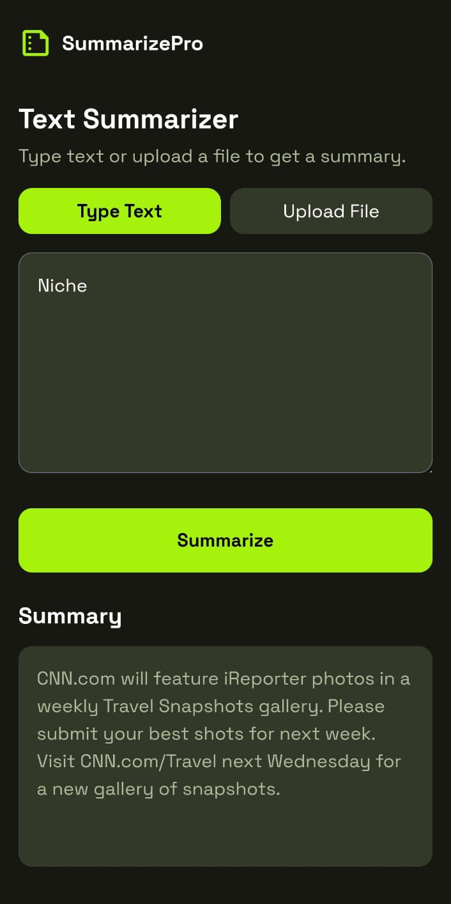
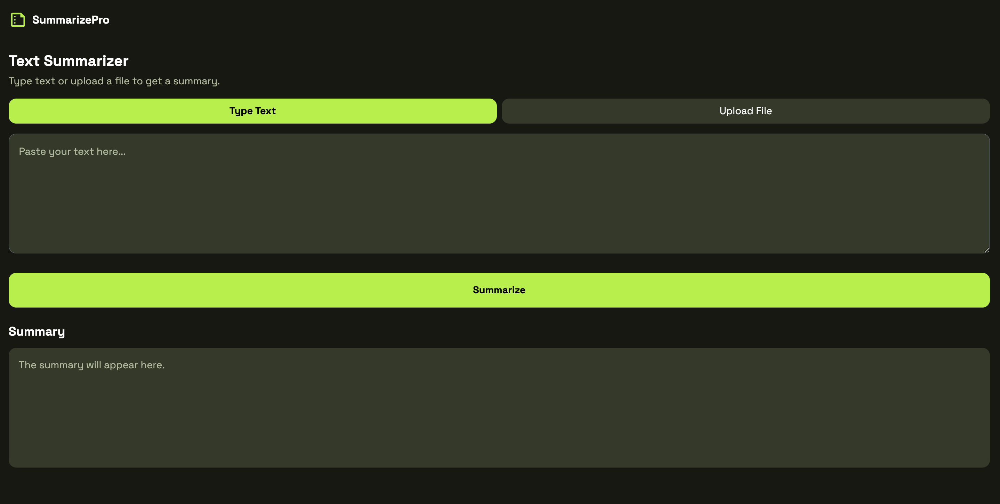

# 🚀 SummarizePro — AI Text & Document Summarizer (PWA)
## On Mobile
<p align="center">
  
</p>


## On PC
<p align="center">
  
</p>
SummarizePro is a full-stack AI-powered web application that summarizes text and documents using a transformer-based language model. It supports direct text input as well as file uploads (PDF, DOCX, TXT) and works on desktop and mobile as a Progressive Web App (PWA).

---

## What It Does

- Summarizes pasted text
- Summarizes uploaded documents (PDF, DOCX, TXT)
- Safely chunks large content to respect model limits
- Runs on mobile browsers and can be installed as a PWA
- Can be accessed publicly using ngrok

---

## Architecture (Single Flow)

Frontend (Browser / Mobile / PWA)  
→ HTTP requests using `fetch()`  
→ FastAPI backend (Uvicorn)  
→ Text extraction + safe chunking  
→ BART (`facebook/bart-large-cnn`)  
→ AI-generated summary  
→ JSON response to frontend

Frontend and backend are decoupled and communicate over HTTP.

---

## Tech Stack

Frontend:
- HTML5
- Tailwind CSS
- Vanilla JavaScript
- PWA (Service Worker + Manifest)

Backend:
- Python 3.9+
- FastAPI
- Uvicorn
- Hugging Face Transformers
- PyTorch
- pdfplumber (PDF extraction)
- python-docx (DOCX extraction)

---


---

## How to Run (End-to-End)

### 1) Clone
```bash
git clone https://github.com/your-username/summarizepro.git
cd summarizepro
```
### 2) Start Backend
```bash
cd backend
source venv/bin/activate
pip install fastapi uvicorn torch transformers pdfplumber python-docx
uvicorn main:app --host 0.0.0.0 --port 8000
```
### 3) In another terminal
```bash
ngrok http 8000
```
## Then access it in the mobile phone by typing the link in the phone


